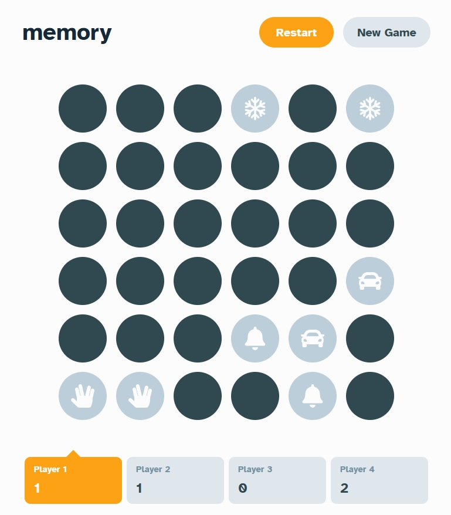

# Frontend Mentor - Memory game solution

This is a solution to the [Memory game challenge on Frontend Mentor](https://www.frontendmentor.io/challenges/memory-game-vse4WFPvM). Frontend Mentor challenges help you improve your coding skills by building realistic projects.

## Table of contents

- [Overview](#overview)
  - [The challenge](#the-challenge)
  - [Screenshot](#screenshot)
  - [Links](#links)
- [My process](#my-process)
  - [Built with](#built-with)
  - [What I learned](#what-i-learned)
  - [Continued development](#continued-development)
  - [AI Collaboration](#ai-collaboration)
- [Local setup](#local-setup)
- [Author](#author)

## Overview

### The challenge

Users should be able to:

- View the optimal layout for the game depending on their device's screen size
- See hover states for all interactive elements on the page
- Play the Memory game either solo or multiplayer (up to 4 players)
- Set the theme to use numbers or icons within the tiles
- Choose to play on either a 6x6 or 4x4 grid

### Screenshot



### Links

- [Solution URL](https://www.frontendmentor.io/solutions/memory-game-using-css-grid-mScOM9JbpA)
- [Live Site URL](https://fem-memory-two.vercel.app/)

## My process

### Built with

- Semantic HTML5 markup
- CSS custom properties
- Flexbox
- CSS Grid
- Mobile-first workflow
- [React](https://reactjs.org/) - JS library
- [TailwindCSS](https://tailwindcss.com/) - CSS framework
- [Vitest](https://vitest.dev/) - Testing framework

### What I learned

By working on this project I learnt about self-hosting fonts. I decided to self-host the Atkinson Hyperlegible font instead of using Google Fonts after discussing the tradeoffs with Claude. It removes a third party round trip on first render and sidesteps EU-regulation.

State management was also a huge pain point in this project. I knew about the `useReducer`-hook and reducer functions but wasn't really comfortable using them. Working on implementing the game logic got me used working with it and I saw the benefits of having that logic all in one place compared to another approach where I would've need to use several `useState` hooks and worry about syncing state all the time.

I also got to know the inner workings of the `cn()` utility function in combination with Tailwind-Merge. I used the function(s) beforehand but didn't really know why. Working on this project I experienced the problems with conflicting classnames first hand and was able to understand the benefits of the function(s).

In the last step of the project I focused on improving accessibility. With the help of Claude I got to know a lot about live announcements which are crucial for a game like this. 

### Continued development

This project is finished and I don't plan to enhance it any further. But I will definitely try to extend my knowledge about accessibility because I felt like I have some gaps in that area. I also want to explore more complex approaches for state management in future projects where it is warranted (maybe give Zustand a try in a future project).

### AI Collaboration

I used Claude Code to work on this project. I used it for planning in terms of getting an overall feel for how to set up the game logic and state management. I used it to discuss different approaches relating to implementing fonts and icons.

In the end I used it to debug and refactor a couple of things. It helped me tremendously in identifying my gaps in terms of accessibility and helped me improve the app in that regard.

## Local setup

```bash
# Clone the repo
git clone https://github.com/michael-schlueter/fem-memory.git
cd fem-memory

# Install dependencies (pnpm)
pnpm install

# Start the dev server
pnpm dev
```

## Author

- Frontend Mentor - [@michael-schlueter](https://www.frontendmentor.io/profile/michael-schlueter)


